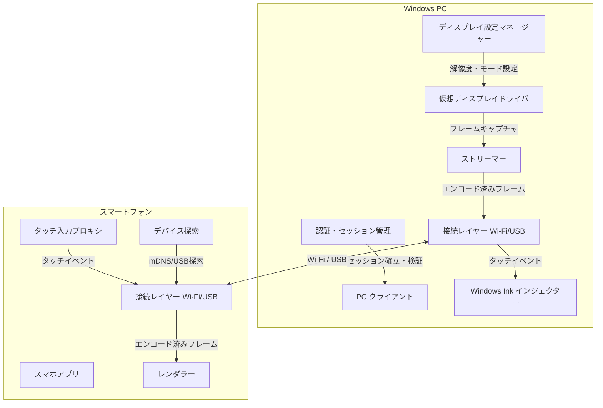
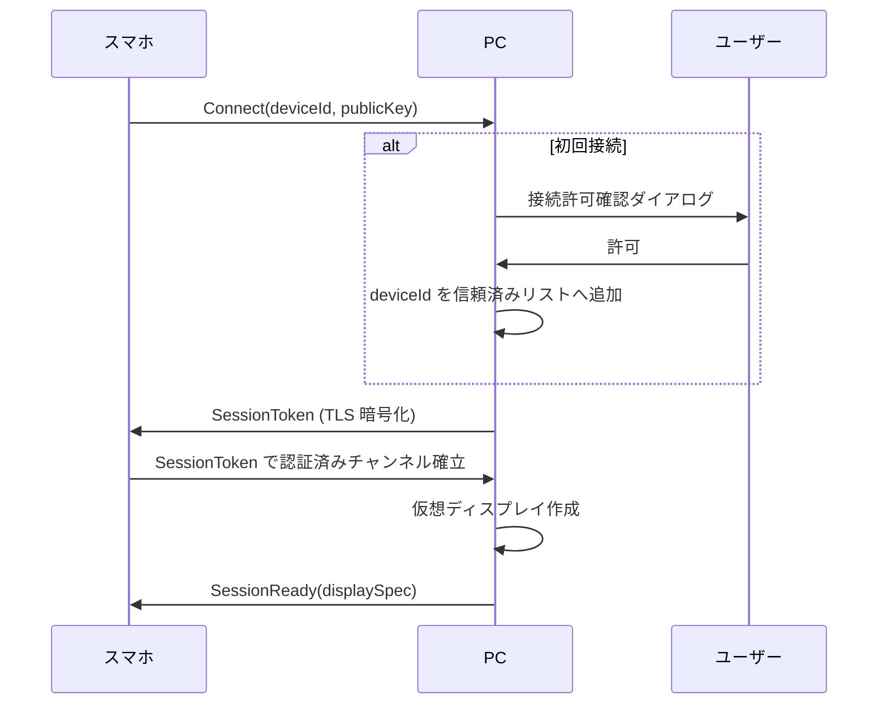
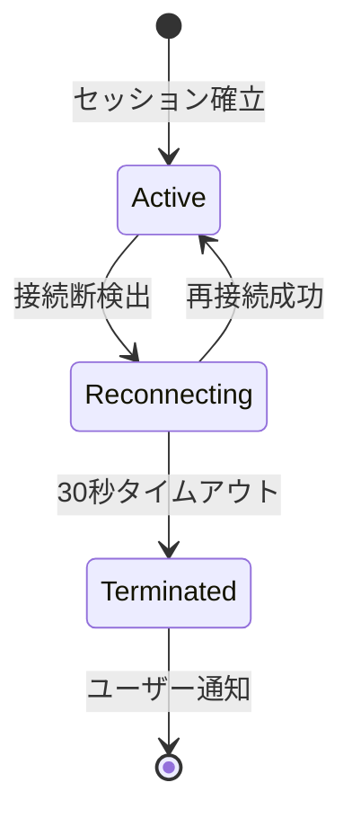

# vmonitor 技術設計書

## Overview

vmonitor は、スマートフォン（iOS / Android）を Windows PC の仮想モニターとして利用するためのアプリケーションです。PC クライアントとスマホアプリの二コンポーネント構成で、仮想ディスプレイドライバを通じて Windows に新しいモニターとして認識させ、映像ストリーミングとタッチ入力の双方向転送を実現します。

### 設計目標

- **ゼロコンフィグ体験**: インストーラー実行だけで動作開始できる
- **低遅延**: 映像遅延 100ms 以内、タッチ入力遅延 50ms 以内
- **高信頼性**: 接続断時の自動回復、エラーログ記録
- **セキュリティ**: デバイス認証とデータ暗号化
- **柔軟な接続**: Wi-Fi・USB 両対応

---

## Architecture

### システム全体構成



### レイヤー構成

```
┌──────────────────────────────────────────────────────────────┐
│                       アプリケーション層                        │
│   PC クライアント UI (WPF/WinUI)  │  スマホアプリ UI (Flutter) │
├──────────────────────────────────────────────────────────────┤
│                        サービス層                              │
│  セッション管理  │ 認証  │ ディスプレイ設定マネージャー          │
├──────────────────────────────────────────────────────────────┤
│                       メディア処理層                            │
│     ストリーマー (エンコード)    │  レンダラー (デコード)        │
├──────────────────────────────────────────────────────────────┤
│                       入力処理層                               │
│  タッチ入力プロキシ  │  Windows Ink インジェクター              │
├──────────────────────────────────────────────────────────────┤
│                       接続層                                   │
│         Wi-Fi (mDNS + TCP/TLS)  │  USB (ADB トンネル)         │
├──────────────────────────────────────────────────────────────┤
│                      OS / ドライバ層                            │
│  仮想ディスプレイドライバ (WDDM)  │  Windows Display API        │
└──────────────────────────────────────────────────────────────┘
```

---

## Components and Interfaces

### 1. 仮想ディスプレイドライバ (VDD)

**役割**: Windows WDDM (Windows Display Driver Model) に準拠した仮想モニターとして OS に認識させる。

**実装アプローチ**: [IddCx (Indirect Display Driver)](https://learn.microsoft.com/en-us/windows-hardware/drivers/display/indirect-display-driver-model-overview) を使用した UMDF2 ドライバとして実装する。IddCx は WDDM 2.4 以降でサポートされており、ユーザーモードで動作するため署名・配布コストが低い。

**インターフェース**:

```csharp
interface IVirtualDisplayDriver
{
    // ドライバのインストール・アンインストール（インストーラーから呼び出し）
    Task InstallAsync();
    Task UninstallAsync();

    // セッション制御
    Task<VirtualDisplayHandle> CreateDisplayAsync(DisplaySpec spec);
    Task RemoveDisplayAsync(VirtualDisplayHandle handle);

    // 解像度・向き更新
    Task UpdateResolutionAsync(VirtualDisplayHandle handle, Resolution resolution, Orientation orientation);

    // フレーム取得（ストリーマーが呼び出す）
    IAsyncEnumerable<VideoFrame> GetFramesAsync(VirtualDisplayHandle handle, CancellationToken ct);
}
```

**インストール方式**: PC クライアントインストーラー（NSIS / WiX）に DriverStore に事前署名済みの IddCx ドライバをバンドルし、`pnputil /add-driver` で自動インストールする。

**ドライバビルド要件**:
- Visual Studio 2026 + WDK (Windows 10.0.28000.0 以降) が必要
- IddCx 1.10 ヘッダー・ライブラリ: `$(WDK)\Include\wdf\umdf\2.31\` および `$(WDK)\Include\10.0.28000.0\um\iddcx\1.10\`
- プラットフォームツールセット: `WindowsUserModeDriver10.0`
- Secure Boot が有効な環境では EV コード署名証明書、または Microsoft WHCP への提出が必要
- Windows 11 では `WudfRd.inf` を Include する INF 形式が推奨
- DLL の配置先は DIRID `%13%`（Driver Store）を使用する


### 2. ストリーマー

**役割**: 仮想ディスプレイのフレームをエンコードしてスマホへ送信する。

**実装アプローチ**: Windows Media Foundation (MF) の `MFT` (Media Foundation Transform) を使って GPU ハードウェアエンコードを利用する。コーデックは H.264 (baseline) をデフォルトとし、端末が H.265/HEVC に対応する場合は切り替える。

```csharp
interface IStreamer
{
    // エンコード設定
    StreamerConfig Config { get; set; }  // ビットレート、解像度、fps、コーデック

    // セッション制御
    Task StartAsync(IVideoFrameSource source, ITransport transport, CancellationToken ct);
    Task StopAsync();

    // アダプティブビットレート通知受信
    void OnBandwidthEstimate(long bitsPerSecond);
}

record StreamerConfig(
    int TargetBitrateBps,
    int MaxFps,                // デフォルト 60、最低保証 30
    VideoCodec Codec,          // H264 | H265
    Resolution TargetResolution
);
```

**適応的品質制御**: 帯域推定（RTCP や独自 RTT 計測）に応じてビットレートと解像度を段階的に下げる。最低品質でも 30fps を維持する。

### 3. レンダラー

**役割**: スマホアプリ側でエンコード済みフレームを受信・デコードして全画面表示する。

**実装アプローチ**: Flutter + プラットフォームチャンネルで iOS (VideoToolbox) / Android (MediaCodec) のハードウェアデコーダーを呼び出す。デコード済みフレームは `Texture` ウィジェットで GPU テクスチャとして表示する。

```dart
abstract class Renderer {
  Future<void> start(Stream<Uint8List> encodedFrames);
  Future<void> stop();
  Stream<RendererStats> get statsStream; // fps, decodeLatencyMs
}
```

### 4. タッチ入力プロキシ

**役割**: スマホのタッチ/スタイラスイベントを収集して PC へ転送し、Windows Ink として注入する。

**スマホ側 (Flutter)**:

```dart
abstract class TouchInputProxy {
  // タッチイベントをシリアライズして送信
  Stream<TouchEvent> captureEvents();
  Future<void> send(ITransport transport, TouchEvent event);
}

class TouchEvent {
  final List<TouchPoint> points;  // マルチタッチ対応
  final DateTime timestamp;
  final Orientation currentOrientation;
}

class TouchPoint {
  final int id;
  final double x, y;       // 正規化座標 [0.0, 1.0]
  final double pressure;   // [0.0, 1.0]
  final TouchPhase phase;  // began | moved | ended | cancelled
}
```

**PC 側 (Windows Ink インジェクター)**:

```csharp
interface IWindowsInkInjector
{
    // 受信タッチイベントを Windows Ink API で注入
    void InjectTouch(IReadOnlyList<TouchPoint> points, DisplayTransform transform);
    void UpdateTransform(Resolution displayResolution, Orientation orientation);
}
```

座標変換: スマホの正規化座標 → 仮想ディスプレイのピクセル座標への変換行列を画面向き変更時に更新する。


### 5. ディスプレイ設定マネージャー

**役割**: Windows の複数ディスプレイ設定（複製・拡張・解像度等）を Windows API 経由で制御する。

```csharp
interface IDisplaySettingsManager
{
    Task SetDisplayModeAsync(VirtualDisplayHandle handle, DisplayMode mode);
    Task SetResolutionAsync(VirtualDisplayHandle handle, Resolution resolution);
    Task<IReadOnlyList<Resolution>> GetSupportedResolutionsAsync(VirtualDisplayHandle handle);
    Task<DisplayConfig> GetCurrentConfigAsync(VirtualDisplayHandle handle);
}

enum DisplayMode { Clone, Extend, SecondaryOnly }
```

Windows API の `SetDisplayConfig` / `ChangeDisplaySettingsEx` をラップする。設定変更は 3 秒以内の適用を保証するため、変更後に `QueryDisplayConfig` でポーリングして適用完了を確認する。

### 6. セッション管理・認証

**役割**: デバイス認証、セッション確立・維持・再接続を管理する。

```csharp
interface ISessionManager
{
    Task<Session> EstablishSessionAsync(DeviceInfo device, CancellationToken ct);
    Task TerminateSessionAsync(Session session);
    Task<ReconnectResult> TryReconnectAsync(Session session, TimeSpan timeout, CancellationToken ct);
    event EventHandler<SessionDisconnectedEventArgs> SessionDisconnected;
}

interface IAuthManager
{
    Task<AuthResult> RequestAuthorizationAsync(DeviceInfo device);  // UI ダイアログ表示
    bool IsTrusted(DeviceIdentifier deviceId);
    void TrustDevice(DeviceIdentifier deviceId);
    void RevokeTrust(DeviceIdentifier deviceId);
    IReadOnlyList<TrustedDevice> GetTrustedDevices();
}
```

**セッション確立フロー**:



**再接続戦略**: 切断検出後、指数バックオフ（初回 1s → 最大 5s）で 30 秒間再試行する。30 秒経過後はセッションを終了してユーザーに通知する。

### 7. Wi-Fi / USB 接続レイヤー

**役割**: Wi-Fi (mDNS 探索 + TCP/TLS) と USB (ADB トンネル) の二系統を統一インターフェースで提供する。

```csharp
interface ITransport
{
    TransportType Type { get; }  // WiFi | USB
    Task ConnectAsync(EndPoint endpoint, CancellationToken ct);
    Task DisconnectAsync();
    Task SendAsync(ReadOnlyMemory<byte> data, ChannelId channel, CancellationToken ct);
    IAsyncEnumerable<(ChannelId, Memory<byte>)> ReceiveAsync(CancellationToken ct);
    long EstimatedBandwidthBps { get; }
}
```

**Wi-Fi 探索**: mDNS (`_vmonitor._tcp`) でサービスを通知・検出する。PC クライアントがサーバー側として起動時に登録する。

**USB 接続**: Android は ADB TCP フォワーディング (`adb forward tcp:7979 tcp:7979`)、iOS は `libimobiledevice` の TCP トンネルを利用する。PC クライアントが USB デバイス接続イベントを監視して自動的にトンネルを確立する。

**チャンネル多重化**: 単一 TCP コネクション上で `ChannelId` によって映像ストリーム・タッチ入力・制御メッセージを多重化する。


---

## Data Models

### セッション

```csharp
record Session(
    Guid SessionId,
    DeviceIdentifier DeviceId,
    TransportType Transport,
    SessionState State,           // Connecting | Active | Reconnecting | Terminated
    DateTimeOffset EstablishedAt,
    VirtualDisplayHandle DisplayHandle
);

enum SessionState { Connecting, Active, Reconnecting, Terminated }
```

### デバイス情報

```csharp
record DeviceInfo(
    DeviceIdentifier Id,          // UUID (スマホが生成・保存)
    string Name,                  // ユーザー表示名
    DevicePlatform Platform,      // iOS | Android
    Resolution PhysicalResolution,
    float PixelDensity            // PPI
);

record TrustedDevice(
    DeviceIdentifier Id,
    string Name,
    DateTimeOffset TrustedAt,
    DateTimeOffset? LastConnectedAt
);
```

### ディスプレイ設定

```csharp
record DisplaySpec(
    Resolution Resolution,
    int RefreshRateHz,
    Orientation Orientation,
    DisplayMode Mode
);

record Resolution(int Width, int Height)
{
    // 仮想ディスプレイの最小・最大サポート範囲
    public static readonly Resolution MinSupported = new(640, 480);
    public static readonly Resolution MaxSupported = new(3840, 2160);
}

enum Orientation { Portrait, Landscape, PortraitFlipped, LandscapeFlipped }
```

### ストリーミング設定

```csharp
record StreamingSettings(
    int BitrateBps,               // デフォルト: 10_000_000 (10 Mbps)
    int MaxFps,                   // デフォルト: 60
    VideoCodec Codec,             // デフォルト: H264
    bool AdaptiveBitrateEnabled   // デフォルト: true
);
```

### タッチイベント (プロトコルバッファ定義)

```protobuf
message TouchEvent {
    repeated TouchPoint points = 1;
    int64 timestamp_us = 2;       // Unix マイクロ秒
    Orientation orientation = 3;
}

message TouchPoint {
    int32 id = 1;
    float normalized_x = 2;       // [0.0, 1.0]
    float normalized_y = 3;       // [0.0, 1.0]
    float pressure = 4;           // [0.0, 1.0]
    TouchPhase phase = 5;
}

enum TouchPhase {
    BEGAN = 0; MOVED = 1; ENDED = 2; CANCELLED = 3;
}
```

### 永続化設定 (JSON)

PC クライアントの設定は `%APPDATA%\vmonitor\settings.json` に保存する。

```json
{
  "trustedDevices": [
    { "id": "uuid", "name": "My iPhone", "trustedAt": "ISO8601" }
  ],
  "streamingDefaults": {
    "bitrateBps": 10000000,
    "maxFps": 60,
    "codec": "H264",
    "adaptiveBitrateEnabled": true
  },
  "displayDefaults": {
    "mode": "Extend",
    "manualResolution": null
  },
  "logFilePath": "%APPDATA%\\vmonitor\\logs\\vmonitor.log"
}
```


---

## Correctness Properties

*プロパティとは、システムの全ての有効な実行において成立すべき特性や振る舞いのことです。プロパティは人間が読める仕様と機械的に検証可能な正確性保証をつなぐ橋渡し役を担います。*

### Property 1: エラーメッセージの表示・非表示の正確さ

*任意の*ドライバインストール失敗エラーコードに対して、インストーラーが生成するエラーメッセージは非空かつ対処手順テキストを含まなければならない。また、インストール成功時にはエラーメッセージが空文字列でなければならない。

**Validates: Requirements 1.5**

### Property 2: デバイス探索のラウンドトリップ

*任意の*有効な mDNS サービスレコードに対して、`discover()` の結果にそのエントリが含まれなければならない。

**Validates: Requirements 2.1**

### Property 3: ディスプレイ追加・削除のラウンドトリップ

*任意の*有効なデバイス情報に対して、セッション確立後にディスプレイ一覧が仮想ディスプレイを含み、セッション切断後にはそのエントリを含まなければならない（追加→削除ラウンドトリップ）。

**Validates: Requirements 3.1, 3.5**

### Property 4: DisplayMode 設定の即時反映

*任意の* DisplayMode 値（Clone / Extend / SecondaryOnly）に対して、`SetDisplayMode` の呼び出し後に `GetCurrentConfig` が同じ値を返さなければならない。

**Validates: Requirements 3.3, 3.4, 7.3**

### Property 5: 映像エンコード・デコードのラウンドトリップ

*任意の*有効なビデオフレームに対して、ストリーマーがエンコードした出力をレンダラーがデコードすることでフレームが正しく復元されなければならない。

**Validates: Requirements 4.1, 4.2**

### Property 6: エンコード処理時間の上限

*任意の*解像度とフレーム内容に対して、ストリーマーの単フレームエンコード処理時間は 100ms 未満でなければならない（ネットワーク転送部分はモックで除外）。

**Validates: Requirements 4.3**

### Property 7: フレームレートの下限保証

*任意の*フレームサイズと負荷条件に対して、ストリーマーは 1 秒間に 30 フレーム以上を出力しなければならない。

**Validates: Requirements 4.4**

### Property 8: 帯域低下時のビットレート適応

*任意の*帯域推定値（0 以上）に対して、`OnBandwidthEstimate` 呼び出し後にストリーマーの出力ビットレートはその帯域推定値以下でなければならない。

**Validates: Requirements 4.5**

### Property 9: ビットレート設定変更の即時反映

*任意の*有効なビットレート値に対して、設定変更後にストリーマーの `Config.TargetBitrateBps` がその値と等しくなければならない。

**Validates: Requirements 4.6**

### Property 10: 向き変更による解像度同期

*任意の* Orientation 値（Portrait / Landscape / PortraitFlipped / LandscapeFlipped）とデバイスの物理解像度に対して、向き変更後に仮想ディスプレイの解像度がスマートフォンの当該向き物理解像度と一致しなければならない。

**Validates: Requirements 5.1, 5.2**

### Property 11: レンダラーの全画面表示（レターボックスなし）

*任意の* DisplaySpec（解像度・向き）に対して、レンダラーが計算する描画領域の幅・高さがスマートフォン画面の全幅・全高と等しくなければならない。

**Validates: Requirements 5.3**

### Property 12: 手動解像度指定の優先

*任意の*自動検出解像度と手動指定解像度の組み合わせに対して、手動解像度が指定されている場合、仮想ディスプレイは手動指定値を使用しなければならない。

**Validates: Requirements 5.4**

### Property 13: 解像度フォールバックの最近傍保証

*任意の*サポート範囲外の解像度に対して、フォールバック後の解像度はサポート済みリストに含まれ、かつ入力解像度との距離が最小でなければならない。

**Validates: Requirements 5.5**

### Property 14: タッチイベントの完全転送

*任意の*タッチイベントリストに対して、タッチ入力プロキシが全てのイベントを PC へ送信しなければならない（欠落なし）。

**Validates: Requirements 6.1**

### Property 15: タッチイベントの Windows Ink 注入

*任意の*タッチイベントに対して、PC クライアントの Windows Ink インジェクターが対応する入力イベントを生成しなければならない（API はモック）。

**Validates: Requirements 6.2**

### Property 16: マルチタッチの同時転送

*任意の* 2 本以上のタッチポイントセットに対して、タッチ入力プロキシは全ポイントを同一メッセージで送信しなければならない（部分送信禁止）。

**Validates: Requirements 6.4**

### Property 17: タッチ入力処理時間の上限

*任意の*タッチイベントに対して、シリアライズ→デシリアライズ→注入の処理時間は 50ms 未満でなければならない（ネットワーク転送部分はモックで除外）。

**Validates: Requirements 6.5**

### Property 18: 向き変更後のタッチ座標変換の正確さ

*任意の* Orientation と正規化タッチ座標 (x, y) に対して、変換後の座標が仮想ディスプレイ解像度における正しいピクセル位置と一致しなければならない。

**Validates: Requirements 6.6**

### Property 19: 設定永続化のラウンドトリップ

*任意の*有効な設定値（StreamingSettings / DisplaySettings）に対して、保存後に読み込んだ設定が元の値と等しくなければならない。

**Validates: Requirements 7.5**

### Property 20: デバイス信頼管理のライフサイクル

*任意の*デバイス識別子に対して、`TrustDevice(id)` 呼び出し後に `IsTrusted(id)` は true を返し、`RevokeTrust(id)` 呼び出し後には false を返さなければならない（追加→確認→削除サイクル）。

**Validates: Requirements 8.2, 8.3, 8.5**

### Property 21: ペイロードの暗号化

*任意の*ペイロードバイト列に対して、暗号化後の出力はペイロードの平文と等しくなってはならない。また、暗号化→復号のラウンドトリップで元のペイロードが復元されなければならない。

**Validates: Requirements 8.4**

### Property 22: 再接続試行の継続性

*任意の*切断タイミング（0 秒以上 30 秒未満）に対して、PC クライアントは切断後 30 秒が経過するまで再接続を試み続けなければならない（モック使用）。

**Validates: Requirements 9.1**

### Property 23: エラーログの記録

*任意の*エラーイベント（エラーコード・メッセージ・タイムスタンプ）に対して、ログ記録後にログファイルからそのエラー情報が読み取れなければならない（ログのラウンドトリップ）。

**Validates: Requirements 9.4**


---

## Error Handling

### エラー分類

| カテゴリ | 例 | 回復戦略 |
|---|---|---|
| インストールエラー | ドライバインストール失敗、権限不足 | エラー詳細と対処手順をユーザーに表示 |
| 接続エラー | Wi-Fi タイムアウト、USB 未検出 | 指数バックオフで自動再試行（最大 30 秒） |
| ストリーミングエラー | エンコード失敗、フレーム欠落 | フレームスキップして継続、フォールバック品質設定 |
| ドライバエラー | VDD 予期停止 | ドライバ再起動試行、失敗時はユーザー通知 |
| 認証エラー | 不明デバイス、トークン期限切れ | セッション拒否とユーザー通知 |
| 設定エラー | 設定ファイル破損 | デフォルト値へのフォールバック |

### エラーログ設計

- **ログ形式**: 構造化 JSON（1 エントリ 1 行）
- **ログパス**: `%APPDATA%\vmonitor\logs\vmonitor.log`
- **ログローテーション**: 10MB 超で自動ローテーション、最大 5 世代保持
- **ログレベル**: DEBUG / INFO / WARN / ERROR の 4 段階

```json
{
  "timestamp": "2024-01-15T10:30:00.123Z",
  "level": "ERROR",
  "component": "VirtualDisplayDriver",
  "message": "ドライバ再起動失敗",
  "errorCode": "VDD_RESTART_FAILED",
  "details": { "attempt": 1, "hresult": "0x80070005" }
}
```

### 再接続フロー



再接続中は仮想ディスプレイを保持し続け、Windows の表示が中断しないようにする。30 秒タイムアウト後にセッションを終了し、仮想ディスプレイをディスプレイ一覧から削除する。

### ドライバ障害回復

1. ドライバ停止を WMI イベント監視で検出する
2. `pnputil /restart-device` でドライバ再起動を試みる（最大 3 回、5 秒間隔）
3. 再起動失敗時はユーザーに ERROR レベル通知を表示し、PCの再起動を案内する

---

## Testing Strategy

### テスト構成

| テスト種別 | 使用ライブラリ | 目的 |
|---|---|---|
| プロパティベーステスト | C#: [FsCheck](https://fscheck.github.io/FsCheck/) / Dart: [dart_test](https://pub.dev/packages/test) + [fast_check](https://pub.dev/packages/fast_check) | 正確性プロパティの検証（各 100 回以上） |
| ユニットテスト | C#: xUnit / Dart: flutter_test | 具体的な例・境界値・エラー条件 |
| インテグレーションテスト | C#: xUnit + WinAppDriver | 外部サービス・OS API との統合確認 |
| スモークテスト | インストーラー後自動実行スクリプト | インストール・設定の確認 |

### プロパティベーステスト設定

各プロパティテストは最低 100 回のランダム入力でテストする。各テストには以下の形式でタグを付与する。

```
// Feature: vmonitor, Property {番号}: {プロパティの簡潔な説明}
```

**C# 例（FsCheck）**:
```csharp
// Feature: vmonitor, Property 4: DisplayMode 設定の即時反映
[Property]
public bool DisplayModeRoundTrip(DisplayMode mode)
{
    var manager = new DisplaySettingsManager(mockVdd);
    manager.SetDisplayMode(testHandle, mode);
    var config = manager.GetCurrentConfig(testHandle);
    return config.Mode == mode;
}
```

**Dart 例（fast_check）**:
```dart
// Feature: vmonitor, Property 18: 向き変更後のタッチ座標変換の正確さ
test('touch coordinate transform is correct for all orientations', () {
  fc.assert(
    fc.property(
      fc.constantFrom(Orientation.values),
      fc.float(min: 0.0, max: 1.0),
      fc.float(min: 0.0, max: 1.0),
      (orientation, normX, normY) {
        final proxy = TouchInputProxy();
        proxy.updateTransform(testResolution, orientation);
        final pixel = proxy.transform(normX, normY);
        expect(pixel.x, greaterThanOrEqualTo(0));
        expect(pixel.x, lessThan(testResolution.width));
      },
    ),
  );
});
```

### ユニットテスト（具体的な例）

以下の具体的なシナリオをユニットテストでカバーする：

- USB デバイス接続イベントでセッション確立が試みられること（2.2）
- タイムアウト後に通知と再試行 UI が表示されること（2.4）
- セッション確立後に VDD の CreateDisplay が呼び出されること（2.5）
- 未知デバイスからの接続で許可ダイアログが表示されること（8.1）
- 30 秒タイムアウト後にセッションが Terminated 状態になること（9.2）
- ドライバ停止イベントで再起動試行が行われること（9.3）
- 設定画面にログファイルパスが表示されること（9.5）

### インテグレーションテスト

- 仮想ディスプレイが `QueryDisplayConfig` で検出可能であること（3.2）
- Windows Ink が有効な状態でインジェクターが初期化できること（6.3）
- 実デバイスでエンドツーエンドの映像ストリーミングが動作すること（4 系統）

### スモークテスト

インストーラー完了直後に自動実行：

- 仮想ディスプレイドライバが DriverStore に存在すること（1.1）
- 必要なネットワークサービスが Running 状態であること（1.2）
- インストール中に手動操作が要求されなかったこと（1.3）

